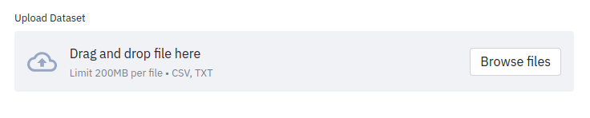
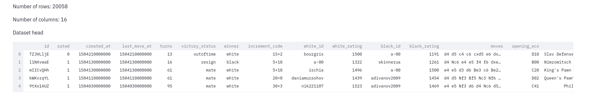
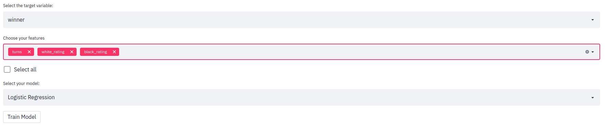
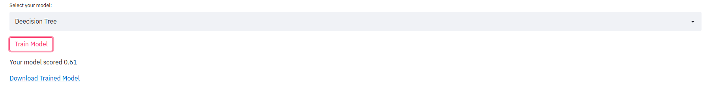
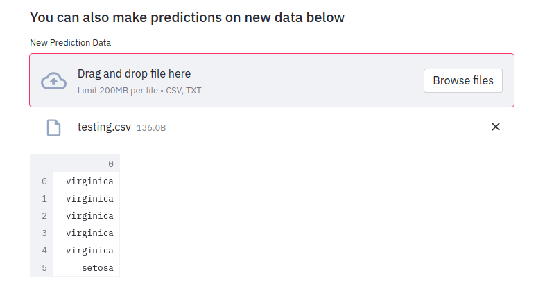
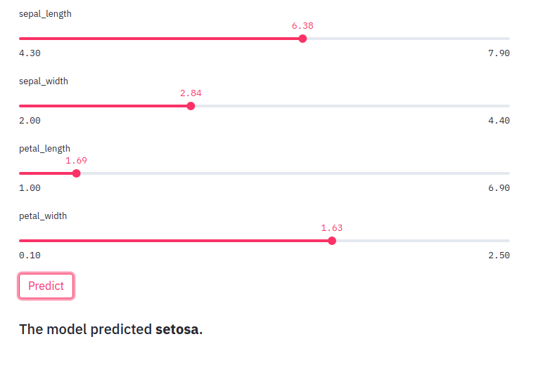
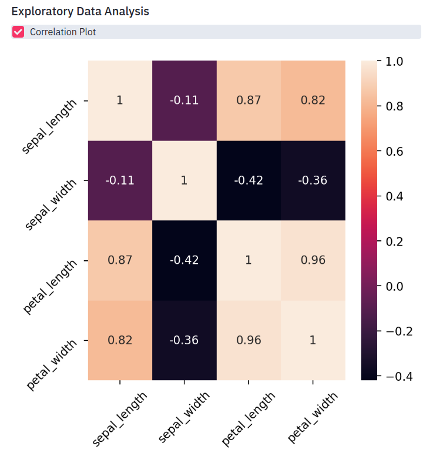
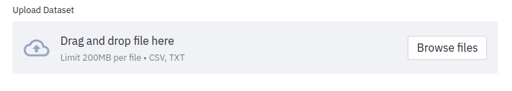

[](https://github.com/psf/black)

# Automated Machine Learning

A web-based application for automating machine learning model development.

<p style='text-align: justify;'>
Computer software in the modern day has found utility in almost everything we do. Particularly in recent years, growth in computational power has enabled us to reap the benefits of machine learning models. This has given rise to all sorts of innovations like product recommendations, fraud detection, and targeted advertising.

Despite being extremely useful in many circumstances, the creation and utilization of these machine learning models are still out of reach for most non-technical people. They require, among other things, a background in computer science and statistics to understand and use effectively. Because of this, most of the machine learning in use today is developed and maintained by a relatively small group of people and organizations.

In this project, I propose to create a web-based application to enable the average person to create their own machine learning models trained on tabular data they select themselves. By giving people the ability to make models on their own, we can democratize the use of machine learning models and make it easy for just about anyone to benefit from their usefulness.

The demo site can be viewed [here.](https://share.streamlit.io/zitorelova/auto-ml/main/main.py)
</p>

## Feature Specifications

#### File Uploader

Adds the ability to upload and process your own datasets.



#### Dataset Summary

Gives you an overview of the dataset after uploading.



#### Model Training

Allows the user to train a model based on a set of features and a target variable they choose.



#### Model Report and Download

After training, the model’s performance is shown with a link to download it for use elsewhere.



#### New Prediction via file uploads

Once a model is trained, a user can make predictions on new data by uploading a file with the same set of features.



#### Individual Predictions with widgets

Once model training is completed, the user will have the option to make individual predictions based on features they have chosen through a set of interactive widgets.



#### Exploratory Data Analysis

Enables a user to analyze their data prior to and/or after modeling.





## Setup

There are two main options to set up the application.

### Docker
To set up the application via Docker, clone the project repository by running the following on your command prompt or terminal (depending on your operating system):

`git clone https://github.com/zitorelova/auto-ml.git`

After this, you need to change your directory to the project folder. You can do this by running:

`cd auto-ml/`

Once inside the project folder, you can build a Docker image by running:

`docker build -t <repo>/<app_name> .`

Replace the `<repo>` and `<app_name>` tags respectively. If you do not want to tag the image, you can simply run:

`docker build .`

After the image has been built you can run it in a container with:

`docker run <repo>/<app_name>`

If you chose not to tag your image, you can run it using its image id. To find this simply type:

`docker images`

You will see a list of available images and columns, one of which represents the image id.

```
REPOSITORY	TAG		IMAGE ID        CREATED           SIZE
<none>      <none>	   0734a3315722    35 seconds ago    1.64GB
```


Once you have the image id you can run the image in a container with:

`docker run <image_id>`


Replace `<image_id>` with the id of your image.


### Creating a local development environment
Create a virtual environment by running:

`python -m virtualenv venv`

After the environment has been created, activate it with:

`source venv/bin/activate`

Next, install requirements by running:

`pip install -r requirement.txt`

Lastly, after the relevant requirements have been installed, you can run the application with:

`streamlit run main.py`

## Citations

<p style='text-align: justify;'>
Harris, C.R., Millman, K.J., van der Walt, S.J. et al. Array programming with NumPy. Nature 585, 357–362 (2020). DOI: 0.1038/s41586-020-2649-2.

Jeff Reback, et al. Pandas-dev/pandas: Pandas 1.3.1. v1.3.1, Zenodo, 25 July 2021, p., doi:10.5281/zenodo.5136416.

Thomas A Caswell, et al. Matplotlib/matplotlib: REL: V3.4.2. v3.4.2, Zenodo, 8 May 2021, p., doi:10.5281/zenodo.4743323.

Michael L. Waskom, . "seaborn: statistical data visualization". Journal of Open Source Software 6. 60(2021): 3021.

Olivier Grisel, et al. Scikit-learn/scikit-learn: Scikit-learn 0.24.2. 0.24.2, Zenodo, 28 Apr. 2021, p., doi:10.5281/zenodo.4725836.

Krekel, H., Oliveira, B., Pfannschmidt, R., Bruynooghe, F., Laugher, B., & Bruhin, F.. (2004). pytest x.y.
</p>
